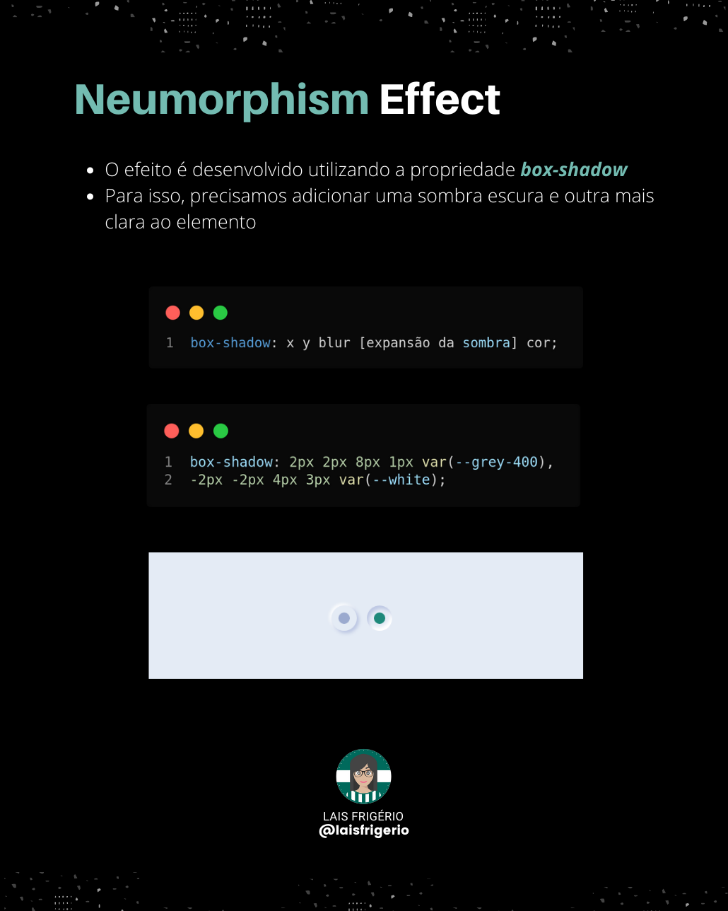

# Neumorphism Effect

A collection of interface elements developed using the Neumorphism effect

  

## Elements

☑️ Radio Button [Código Fonte](./radio-button) | [Vídeo]()
☐ Checkbox
☐ Search input
☐ Switch
☐ Progress Bar
☐ Button
☐ Clock
☐ Calendar

## :woman: Author

| [ <b>@laisfrigerio</b>](https://github.com/laisfrigerio)  |
| :---: |

## 📄 License

This project is licensed under the MIT License - see the LICENSE file for details
