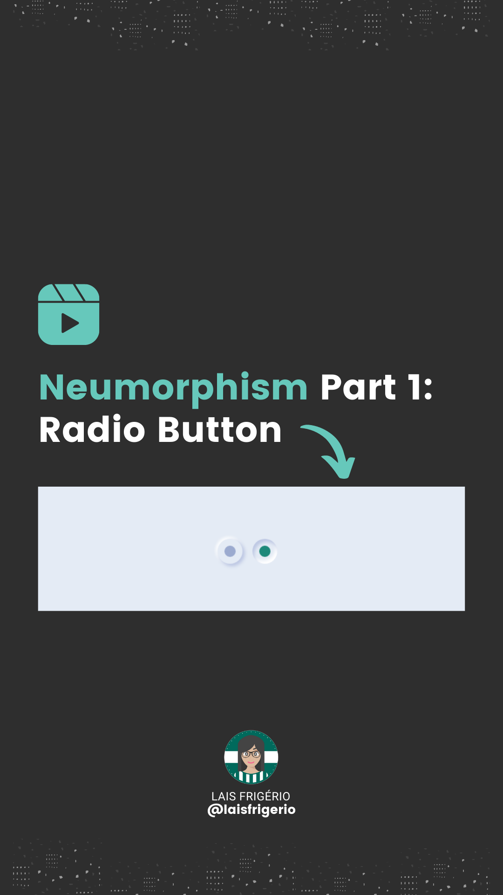
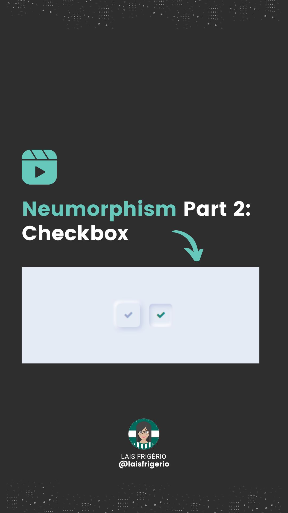

# Neumorphism Effect

A collection of interface elements developed using the Neumorphism effect

  

## Elements

- ☑️ Radio Button [Código Fonte](./radio-button) | [Vídeo](https://www.instagram.com/reel/Ccf9ZhMFhxa/)

  

- ☑️ Checkbox [Código Fonte](./checkbox) | [Vídeo](https://www.instagram.com/reel/CciPO_iFsY9/)

  

- ☐ Search input
- ☐ Switch
- ☐ Progress Bar
- ☐ Button
- ☐ Clock
- ☐ Calendar

## :woman: Author

| [ <b>@laisfrigerio</b>](https://github.com/laisfrigerio)  |
| :---: |

## 📄 License

This project is licensed under the MIT License - see the LICENSE file for details
